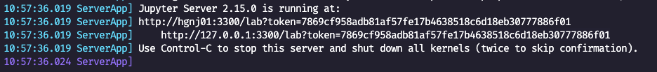

## Getting started

Make sure you have installed [Apptainer](https://apptainer.org/docs/user/main/introduction.html) in your machine.

You can download the `jsalt.sif` file from huggingface by clicking [here](https://huggingface.co/Play-Your-Part/tutorials-apptainer-sif-file/resolve/main/jsalt.sif).

> **Note:** alternativelly, you can built the `jsalt.sif` from scratch, for instance using Slurm with:
> ```
> sbatch apptainer_build.sbatch
> ```
> You should first update the `.sbatch` file to match your credentials and computing, etc.

(optional) Slurm: connect to a GPU node in interactive mode:
```bash
salloc -A YOUR_USER -p gpu -t 03:00:00 --gpus rtx3090:1
```
(optional) change default ollama `~/.ollama/models` folder to store the models to our current folder:
```bash
export APPTAINERENV_OLLAMA_MODELS="$(pwd)/.ollama/models"
```

Let's check if our apptainer is working:

```bash
apptainer run --nv jsalt.sif

ls -lh
```
We see the apptainer by default does not have access to the host current direction (the content of the `tutorials` folder).
Let's close it with Ctrl+D and call run but with the `-H` flag to set the apptainer home directorey to the host current directory:

```bash
apptainer run -H $(pwd) --nv jsalt.sif

ls -lh
```
Now we should see all our files.
Let's try now try using gemma3-1b model with ollama:

```bash
ollama serve &
ollama run gemma3:1b

>>> What model are you?
```
> I’m Gemma, a large language model created by the Gemma team at Google DeepMind.
> I’m an open-weights model, which means I’m widely available for public use!

Pres Ctrl+D to close the chat.
Let's try the following piece of Python code that uses [LangChain](https://github.com/langchain-ai/langchain) to interact with our [ollama](https://github.com/ollama/ollama) models.
Type `python3` and paste the following code:

```python
from langchain_ollama.chat_models import ChatOllama
llm = ChatOllama(model="gemma3:1b", temperature=0)
response = llm.invoke([
    ("system", "You are the best japanese translator in the world."
               "Translate the user sentence to casual japanese without explanations."),
    ("human", "I love JSALT workshop :)")
])
print(response.content)
```
> いいね、JSALT Workshop 好きだね！ 😊


## Jupyter Notebook

Run the Jupyter server inside the apptainer first:

```bash
apptainer run -H $(pwd) --nv jsalt.sif

exec jupyter lab --no-browser --ip 0.0.0.0 --port 3300
```

And then copy the URL that was printed when running the Server including the token value. For instance, for the following log:



The url is the following:
```
http://127.0.0.1:3300/lab?token=7869cf958adb81af57fe17b4638518c6d18eb30777886f01
```

You can then paste this URL directly in your browser to get access to the notebooks.

> **Note:** If you're running apptainer in a remote node, we will need to use SSH port forwaring/tunneling. In your host machine run:
> 
> ```bash
> ssh -N -L 3300:localhost:3300 NODE_NAME
> ```

You can connect using VS code too, instead of your browser, make sure you have the Jupyter extension installed. Then in VS Code, click on [connect to server](https://code.visualstudio.com/docs/datascience/jupyter-kernel-management#_existing-jupyter-server) and paste the Jupyter server URL to connect.

We're going to use Ollama in our tutorials, and we can run Ollama server inside a cell by doing the following "trick" to allow running background processes within a cell:

```python
import os
get_ipython().system = os.system  # <- little hack

!ollama serve &
```
Note: the first two lines are a simple hack to allow running background processes (e.g. "`ollama serve &`") inside the notebook.

### Dataset Preparation

```bash
cd datasets
git clone git@github.com:RasaHQ/STAR.git
```
Make sure you end up with the STAR dataset in `datasets/STAR` with `dialogues` and `tasks` folders inside.

---

### Run my python script from outside the apptainer?

Another option is to use the Apptainer `exec` command to run the python script directly from outside the apptainer.
Press Ctrl+D to close our apptainer. Now try running the `test_chatollama.py` as follows:
```bash
# in some environemnt D-Bus session bus (IPC) creates errors
# when running an apptainer instance, so, in case of errors,
# we can disable it with:
# unset DBUS_SESSION_BUS_ADDRESS

apptainer instance start --nv jsalt.sif jsalt
apptainer exec instance://jsalt ollama serve &

# run all the scripts we want to
apptainer exec instance://jsalt python3 test_chatollama.py

# once finished, we can stop the background instance
apptainer instance stop jsalt
```
> いいね、JSALT Workshop 好きだね！ 😊

